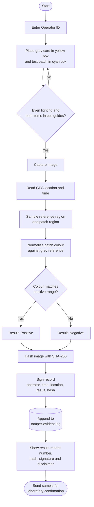
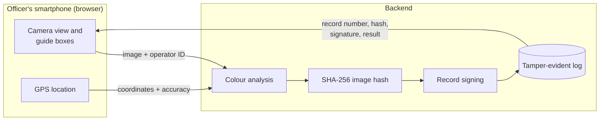
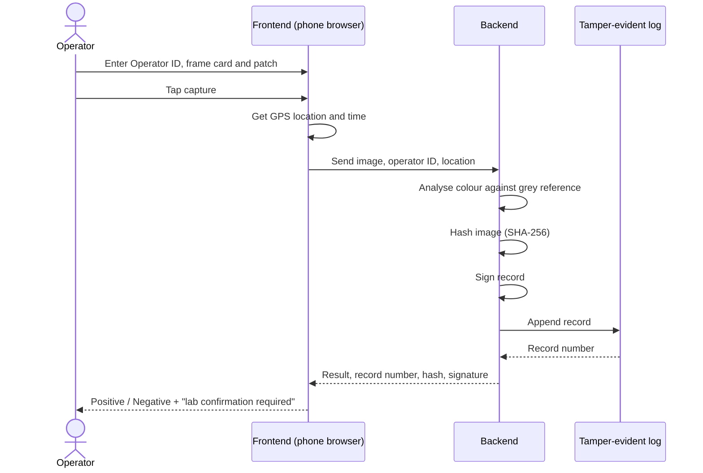

# HueProof: Tamper-Evident Smartphone Reader for Presumptive Drug Tests

**Team ResQbit** | Smart India Hackathon 2026

HueProof turns a phone camera into an objective reader for colour-based drug test patches. The officer frames a grey reference card and the test patch, taps once, and gets a **Positive / Negative presumptive result**. The result is saved as a signed, tamper-evident record.

> **Presumptive result only. Laboratory confirmation is required.** HueProof supports field screening. It does not replace laboratory analysis.

---

## Why this exists

*Reading colour tests by eye is subjective, and the paper trail behind them is weak.*

Reading a colour test by eye is subjective. The result changes with lighting, the phone, and the person looking at it. The record of who tested, where and when is often just paper. HueProof addresses both problems:

- **Objective reading:** the patch colour is compared against a grey reference card captured in the same frame, which reduces the effect of lighting.
- **Defensible record:** every test is saved with the operator ID, GPS location, timestamp, SHA-256 hash of the image, and a digital signature of the record.

## Features

*What the prototype can do today.*

- Mobile-browser web app, no app install needed
- On-screen guides: a **yellow box** for the grey reference card and a **cyan box** for the test patch
- Positive / Negative presumptive result
- Operator ID entered for each session
- GPS location with accuracy shown (for example, `±15 m`)
- Numbered records in a tamper-evident log
- SHA-256 image hash and record signature shown for every result
- Built-in disclaimer on every result

## How it works

*The five steps from capture to a sealed record.*

1. **Capture:** the operator enters an Operator ID, then places the grey card in the yellow box and the test patch in the cyan box, in even lighting.
2. **Calibrate:** the app samples both regions and uses the grey card as the reference.
3. **Analyse:** the patch colour is compared with the reference and classified as Positive or Negative.
4. **Seal:** the app hashes the image (SHA-256) and signs the record together with the time, location and operator ID.
5. **Log:** the record is appended to the tamper-evident log and shown to the operator with its record number.

## Flowcharts

*Diagrams of the test workflow, system structure and message flow.*

### Test workflow

*Every decision and step an operator goes through in one test.*




### System overview

*How the phone and the backend share the work.*




### Sequence of one test

*The order of messages between operator, frontend, backend and log.*



> The diagrams follow the prototype's behaviour and the `frontend/` and `backend/` split. Adjust step names if your code divides the work differently.

## Screenshots

*The working prototype on a phone, with a Positive and a Negative result.*

**Capture screen on a phone** (operator ID, guide boxes, location, saved record)


**Results**


Each result shows the record number, time, SHA-256 image hash, record signature and the "presumptive only" disclaimer.

## Repository structure

*What lives in each folder of this repo.*

```
ResQbit_Drugs/
├── backend/     # server: analysis, hashing, signing, record log
├── frontend/    # mobile-browser web app: camera UI, guides, result display
├── docs/        # images used in this README
│   ├── mobile-capture-screen.png   # IMAGE 1
│   ├── result-positive.png         # IMAGE 2
│   └── result-negative.png         # IMAGE 3
└── .gitignore
```

## Getting started

*How to run HueProof locally and open it on a phone.*

> Fill in the exact commands for your stack. Placeholders are marked with `TODO`.

### Prerequisites

*What to install before running the project.*

- TODO: runtime and version (for example Node.js or Python)
- A smartphone with a camera and a modern browser
- Phone and computer on the same Wi-Fi network for local testing

### Run the backend

*Start the server that analyses, hashes, signs and logs.*

```bash
cd backend
# TODO: install dependencies
# TODO: start the server
```

### Run the frontend

*Start the web app that shows the camera view and results.*

```bash
cd frontend
# TODO: install dependencies
# TODO: start the dev server (the prototype was served on port 3000)
```

### Open on your phone

*Connect a phone on the same Wi-Fi network to the running app.*

1. Find your computer's local IP address.
2. On the phone, open `http://<your-ip>:3000`.
3. Allow camera and location access when the browser asks.

> **Note:** most mobile browsers only allow camera and location access on `https://` or `localhost`. If the camera does not start over plain `http` on your local network, serve the app over HTTPS or use your browser's setting for insecure origins during development.

## Configuration

*Settings to set before the first run.*

| Setting | Purpose |
|---|---|
| TODO: signing key | Used to sign each record. Keep it secret and out of the repository. |
| TODO: port | Port the app is served on |

Never commit signing keys or `.env` files. Make sure they are listed in `.gitignore`.

## Using it correctly

*Tips for getting a reliable reading.*

- Use even lighting and avoid strong shadows or glare.
- Keep the grey card and the test patch flat and inside their guide boxes.
- Treat every result as **presumptive**. Send the sample for laboratory confirmation.

## Limitations

*What the current prototype cannot do yet.*

- Accuracy depends on lighting and camera quality. Thresholds need validation across phone models.
- The result is a screening aid, not proof of the substance.
- TODO: list any other known limits of the current prototype.

## Roadmap

*Planned next steps.*

- Field trials across phone models and lighting conditions
- Offline capture with later sync
- Support for more colour-based test kits
- Record verification tool for labs and courts


